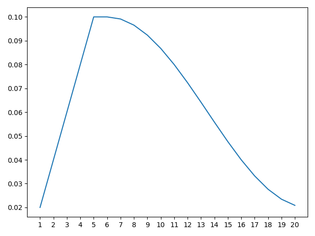

# pytorch-gradual-warmup-lr

Gradually warm-up(increasing) learning rate for pytorch's optimizer. Proposed in 'Accurate, Large Minibatch SGD: Training ImageNet in 1 Hour'.

## Install

```
$ pip install git+https://github.com/ildoonet/pytorch-gradual-warmup-lr.git
```

## Usage

Example : Gradual Warmup for 5 epoch, after that, use cosine-annealing. See [run.py](warmup_scheduler/run.py) file.

