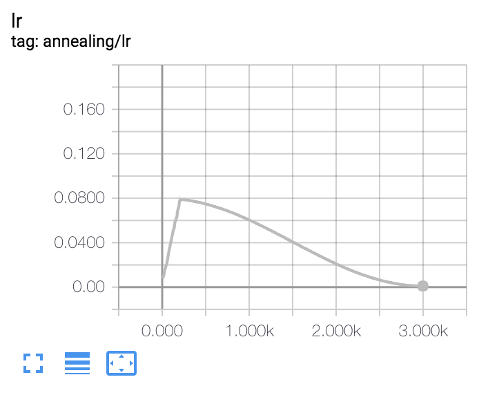

# pytorch-gradual-warmup-lr

Gradually warm-up(increasing) learning rate for pytorch's optimizer. Proposed in 'Accurate, Large Minibatch SGD: Training ImageNet in 1 Hour'.


Example : Gradual Warmup for 100 epoch, after that, use cosine-annealing.

## Install

```
$ pip install git+https://github.com/ildoonet/pytorch-gradual-warmup-lr.git
```

## Usage

See [run.py](warmup_scheduler/run.py) file.

```python
import torch
from torch.optim.lr_scheduler import StepLR, ExponentialLR
from torch.optim.sgd import SGD

from warmup_scheduler import GradualWarmupScheduler


if __name__ == '__main__':
    model = [torch.nn.Parameter(torch.randn(2, 2, requires_grad=True))]
    optim = SGD(model, 0.1)

    # scheduler_warmup is chained with schduler_steplr
    scheduler_steplr = StepLR(optim, step_size=10, gamma=0.1)
    scheduler_warmup = GradualWarmupScheduler(optim, multiplier=1, total_epoch=5, after_scheduler=scheduler_steplr)

    # this zero gradient update is needed to avoid a warning message, issue #8.
    optim.zero_grad()
    optim.step()

    for epoch in range(1, 20):
        scheduler_warmup.step(epoch)
        print(epoch, optim.param_groups[0]['lr'])

        optim.step()    # backward pass (update network)
```
